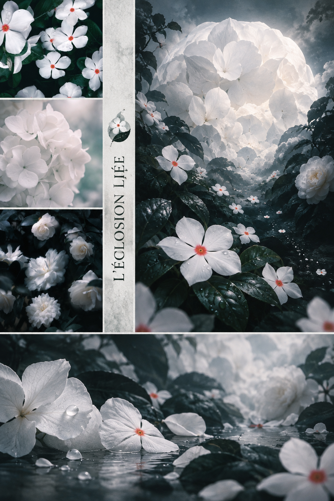
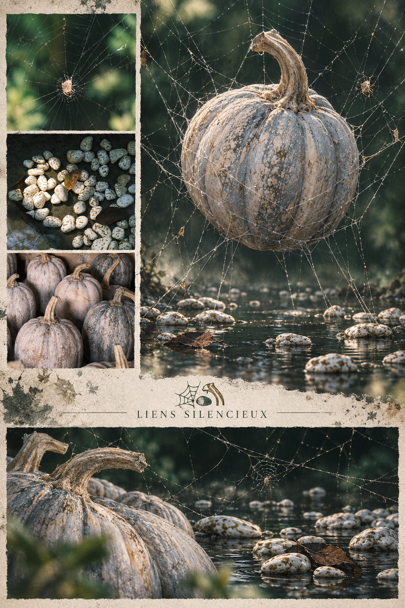
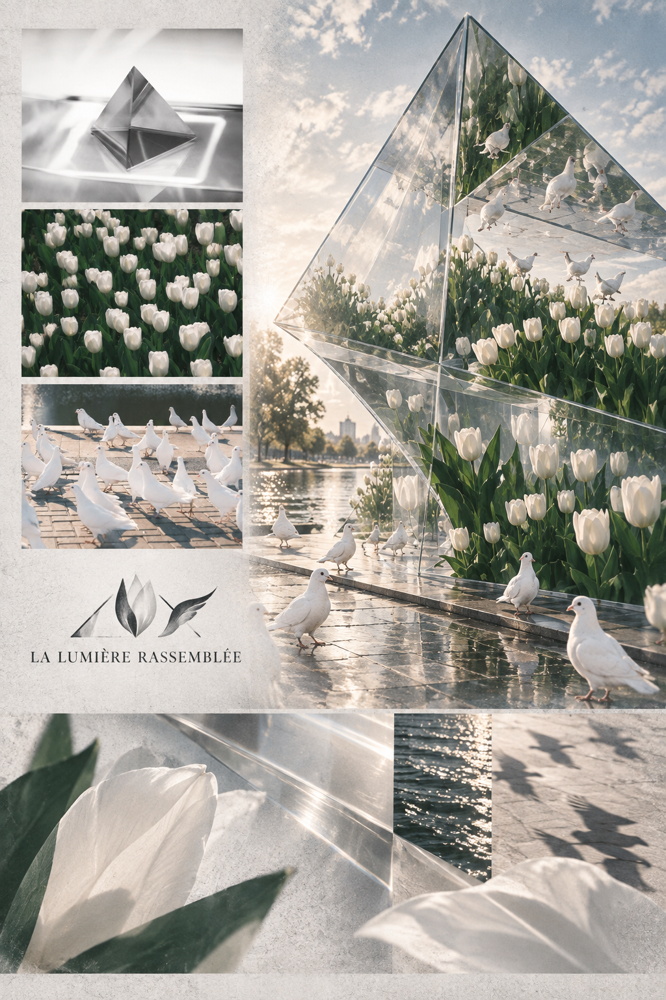
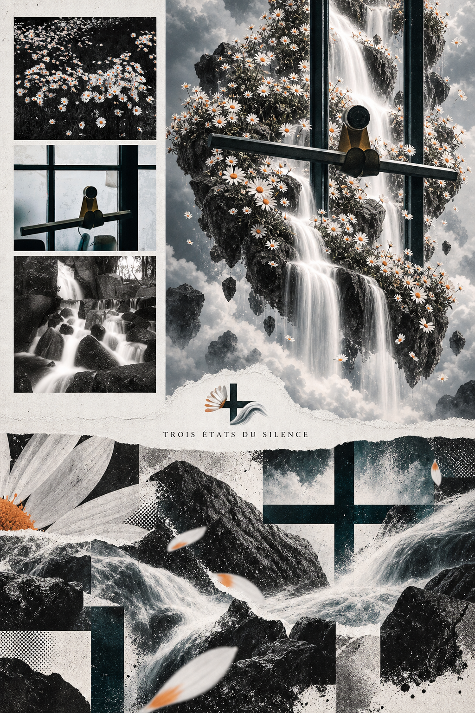

<div align="center">

# 【S.014】Starryear-Mix丨星年·融合

**让三张原图经过荒诞尺度、超现实重构、非重复解构与法语三形标识，汇成一幅有证据也有异境的摄影长卷。**


[](./LICENSE.md)
[](#)

</div>

---

## ⚠️ 声明

> **仅限个人学习、非营利研究与非商业创作。**
> 任何商业使用均须事先取得 Starryear年 的书面许可。
>
> 分享作品时，欢迎标注来源并 **@Starryear年**。

---

## 📖 关于本项目

本项目保留三张佛教主题照片作为左上角的原始证据，同时生成右上角荒诞超现实的“重重构”主视觉与下方 16:9 横向“解”构图，再把一个由三张原图分别提炼、拼合而成的极简小 Logo 和一组艺术法语放进中间留白。佛相可以被放大成山体、月亮、地平线或悬浮建筑，与微缩人物和现实空间形成明显尺度悖论；五官、神态与宗教身份仍保持端正。每次从原图重新提取两至三种颜色，色块轮廓、Logo 几何与文字节奏也从原图的主体、阴影、透视与负形中生长。

- ✅ 三张原图、上方重重构与下方释放式解构形成清楚递进
- ✅ 每次重新提取 2–3 种来源色与来源形，不套用红蓝和圆盘模板
- ✅ 中间新增文字统一使用自然、诗性的艺术法语，不加入中文、梵语或英文说明
- ✅ 三张原图各贡献一个抽象形，拼成一个小而完整的极简 Logo
- ✅ Logo 与法语共同补入中间留白，成为一组编辑签名，不做企业商标或水印
- ✅ 佛首可极端放大，以巨物与微缩现实制造荒诞超现实
- ✅ 地点只采用用户明确提供的文字，不根据画面猜测
- ✅ 参考风格只用于配色与大色块逻辑，不借用其题材、纹理或具体构图
- ❌ 不做普通网格，也不编造城市、寺名或历史信息

> 📝 The Skill includes the complete prompt in both **Chinese** and **English**.

---

## 🖼️ 示例作品

<p align="center">
  
  
</p>
<p align="center">
  
  
</p>

---

## 📋 目录

- [使用方法](#-使用方法)
- [可自由调整的部分](#️-可自由调整的部分)
- [核心原则](#-核心原则)
- [内容结构](#-内容结构)
- [许可证](#-许可证)

---

## 🚀 使用方法

### 方式一：作为 Codex Skill 使用

1. 将整个 `starryear-three-photo-pop-collage` 文件夹放入 Codex skills 目录。
2. 开启新对话并上传三张相关照片。
3. 提出需求：

   > 使用 `starryear-three-photo-pop-collage` 把这三张照片做成一张包含原图、超现实重构、横向解构，以及中间法语三形标识的最终总图。

4. 如需表达指定题意请同时提供；“佛诞生”主题默认使用 `L'ÉVEIL NAISSANT`。用户提供中文题意时将其转成自然、艺术化的法语，成品画面不放置新增中文。

### 方式二：作为提示词直接使用

| 语言 | 文件 |
| :---: | :--- |
| 🇨🇳 中文 | [references/starryear-three-photo-pop-collage-prompt.zh-CN.md](references/starryear-three-photo-pop-collage-prompt.zh-CN.md) |
| 🇬🇧 English | [references/starryear-three-photo-pop-collage-prompt.en.md](references/starryear-three-photo-pop-collage-prompt.en.md) |

---

## 🎛️ 可自由调整的部分

| 参数 | 说明 |
| :--- | :--- |
| **总图比例** | 默认竖版 2:3，可在相近比例内适配发布平台 |
| **色彩强度** | 融合图与解构图可分别调整，但必须呈现清楚差异 |
| **综合色谱** | 每次从三张原图的光色、材质、环境或真实对比中重新提取 2–3 种颜色 |
| **色块结构** | 从主体轮廓、阴影、透视、开口与负形提炼；不固定圆盘、拱形或斜楔 |
| **上下关系** | 上方负责荒诞尺度与超现实重构；下方负责解元素、裁片、剪影和色块轮廓，且构图与元素不得重复 |
| **超现实强度** | 佛首可放大至常理尺度约 2–5 倍，并通过微缩人物、遮挡和地平线强化巨物感 |
| **文字内容** | 中间新增文字统一使用自然、诗性的法语；佛诞生主题默认 `L'ÉVEIL NAISSANT` |
| **Logo 结构** | 三张原图各提炼一个形，通过共轴、咬合、叠接或同一笔势组成一个极简小标识 |
| **中缝融合** | Logo 与法语共同占据中间留白，可上下、左右或轻微咬合，保留充足呼吸感 |
| **书写质感** | 允许飞白、枯笔、断墨与手作不均匀感，但不破坏法语重音、拼写和可读性 |

---

## 💡 核心原则

1. **证据先行** — 三张原图必须在总图中真实可见，不能被生成内容替代。
2. **两次转译** — 上方重重构、下方做释放式解构；元素、裁片、剪影、色块轮廓和构图均不得重复。
3. **来源色与来源形** — 色彩和形状都从本组三张照片重新提取，不沿用预制配方。
4. **荒诞来自尺度** — 用一个清楚的不可能事件制造超现实，不靠堆砌无关梦境装饰。
5. **三形标识必须完整且融合** — 三张原图各贡献一个可追溯的抽象形，拼成一个单体极简 Logo；所有中间新增文字统一使用艺术法语，并与 Logo 共同补入留白。渲染不准时先生成无字画面与 Logo，再后期排入准确法语并做纹理融合。

---

## 📁 内容结构

```text
starryear-three-photo-pop-collage/
├── README.md
├── LICENSE.md
├── SKILL.md
├── agents/openai.yaml
├── references/
│   ├── starryear-three-photo-pop-collage-prompt.zh-CN.md
│   └── starryear-three-photo-pop-collage-prompt.en.md
└── assets/examples/
    ├── example-01.png
    ├── example-02.png
    ├── example-03.png
    └── example-04.png
```

---

## 📄 许可证

本项目采用 [LICENSE.md](./LICENSE.md) 中规定的使用条款。

---

<div align="center">

**如果这个项目对你有帮助，欢迎 Star ⭐ 支持！**

</div>
